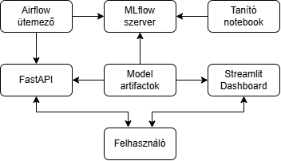

# Iris Classification MLOps Project

This project demonstrates a complete MLOps (Machine Learning Operations) pipeline for a machine learning model that classifies iris flowers based on their measurements. It showcases the integration of modern ML tools and practices in a production-ready environment.

## Project Overview

The Iris Classification system uses scikit-learn to train a model on the classic Iris dataset. The project implements a full MLOps pipeline including:
- Model training and versioning
- API deployment
- User-friendly dashboard
- Model monitoring and reporting
- Automated workflow scheduling

## Project Components

### FastAPI Backend
- REST API for serving predictions
- Endpoint for real-time inference
- Integration with MLflow for model loading
- Input validation and error handling

### Streamlit Dashboard
- User interface for making predictions
- Interactive data visualization
- Model monitoring reports
- On-demand report generation

### MLflow
- Model tracking and versioning
- Experiment comparison
- Model registry
- Centralized artifact storage

### Evidently AI
- Model monitoring reports
- Data drift detection
- Performance tracking
- Automated report generation

### Airflow
- Workflow automation
- Scheduled model retraining
- DAG-based pipeline management
- Failure handling and notifications

## Architecture



### Data Flow
1. Training notebooks create models that are registered in MLflow
2. Models and artifacts are versioned and stored
3. FastAPI loads the model for inference
4. Streamlit dashboard communicates with the API and MLflow
5. Airflow schedules regular retraining and monitoring tasks
6. Users interact with both the API and dashboard

## Getting Started

### Prerequisites

- Docker and Docker Compose
- Python 3.9+
- Git

### Running the Project

1. Clone the repository:

```bash
git clone <repository-url>
cd iris-mlops-project
```

2. Run the Docker Compose file:

```bash
docker-compose up -d
```

3. Access the services:
   - Streamlit Dashboard: http://localhost:8501
   - FastAPI API: http://localhost:8000
   - MLflow Server: http://localhost:5000
   - Airflow Webserver: http://localhost:8080

### Initial Setup

After starting the services, you'll need to:

1. Generate the initial model (if not present):
```bash
python generate_initial_model.py
```

2. Initialize MLflow experiment (if needed):
```bash
python init_mlflow.py
```

3. Generate a model monitoring report:
```bash
python generate_report.py
```

### Using the Services

#### FastAPI
- Make predictions at: http://localhost:8000/predict
- View API documentation at: http://localhost:8000/docs

#### Streamlit Dashboard
- Access the interactive UI at: http://localhost:8501
- Use the sidebar to navigate between prediction and monitoring pages

#### MLflow
- View experiments and models at: http://localhost:5000
- Compare runs and download artifacts

#### Airflow
- Access the Airflow UI at: http://localhost:8080
- Default credentials: airflow/airflow
- Activate DAGs as needed

### Running Tests

```bash
pytest tests/
```

## Project Structure

```
.
├── app/                    # FastAPI application
│   └── main.py             # API implementation
├── airflow/                # Airflow configuration
│   ├── dags/               # Airflow DAGs
│   │   └── iris_dag.py     # Iris pipeline DAG
│   ├── config/             # Airflow configuration files
│   ├── logs/               # Airflow logs
│   └── plugins/            # Airflow plugins
├── mlruns/                 # MLflow tracking data
├── mlartifacts/            # MLflow artifacts
├── notebooks/              # Jupyter notebooks
│   └── 01_training.ipynb   # Model training notebook
├── streamlit_app/          # Streamlit dashboard
│   └── dashboard.py        # Dashboard implementation
├── tests/                  # Tests
│   └── test_api.py         # API tests
├── .env                    # Environment variables
├── docker-compose.yml      # Docker Compose configuration
├── Dockerfile              # Dockerfile for FastAPI app
├── mlflow.Dockerfile       # Dockerfile for MLflow
├── streamlit.Dockerfile    # Dockerfile for Streamlit
├── create_experiment.py    # Script to create MLflow experiment
├── generate_initial_model.py # Script to generate initial model
├── generate_report.py      # Script to generate Evidently report
├── init_mlflow.py          # Script to initialize MLflow
├── model.joblib            # Saved model
├── README.md               # This file
├── requirements.txt        # Python dependencies
├── scaler.joblib           # Saved scaler
└── system_info.json        # System information
```

## Model Information

### Dataset
The model uses the classical Iris dataset, which contains measurements for three species of iris flowers:
- Setosa
- Versicolor
- Virginica

Features include sepal length, sepal width, petal length, and petal width.

### Model Architecture
The system uses a scikit-learn classifier (typically Random Forest) trained on the Iris dataset. Feature scaling is applied to normalize inputs before prediction.

### Performance Metrics
The model is evaluated using:
- Accuracy
- Precision
- Recall
- F1 Score

## Continuous Integration/Deployment

This project uses basic CI/CD principles:
1. Code changes are tested automatically
2. Models are versioned in MLflow
3. Airflow handles regular retraining
4. Docker containers ensure consistent environments

## Troubleshooting

### Common Issues

#### MLflow Connection Problems
- Ensure MLflow server is healthy with `docker-compose ps`
- Check if the correct port is exposed (5000)
- Verify network connectivity between containers

#### API Errors
- Check logs with `docker-compose logs api`
- Ensure model.joblib and scaler.joblib exist
- Verify environment variables are correctly set

#### Dashboard Issues
- Check logs with `docker-compose logs dashboard`
- Ensure API is accessible from the dashboard
- Verify report generation is working

## Development Guidelines

### Adding New Features
1. Create a feature branch
2. Implement changes with tests
3. Update documentation
4. Submit a pull request

### Model Updates
1. Update the training notebook
2. Register new model in MLflow
3. Update the model artifact or API to use new version

## License

This project is licensed under the MIT License - see the LICENSE file for details.